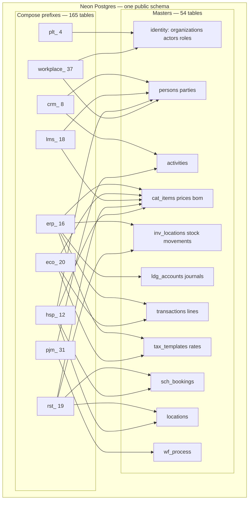

# Database design

One Postgres database (Neon), one Drizzle journal under `apps/server`. Composes do **not** own separate databases. They own **prefixed table families** in the same schema.

Columns and constraints live in source:

- Masters: `apps/server/src/infra/db/schema/`
- Compose detail: `composes/<name>/server/src/db/schema/`
- Migrations: `apps/server/src/infra/db/migrations/`

When this file and schema disagree, trust schema.

## Rules

- Shared facts live on **master** tables (unprefixed or short family prefixes: `cat_`, `ldg_`, `inv_`, `sch_`, `wf_`, `tax_`, `doc_`, `ntf_`, `geo_`, `anl_`).
- Compose tables use a **compose prefix** and hold **detail only**.
- Cross-table links are `text` ids (implicit FKs). Modules talk over EventBus + CQRS; composes never import each other.
- Money on masters is integer minor units unless a compose table still uses `numeric` (legacy columns).

Counts from current Drizzle `pgTable` declarations: **54** master tables, **165** compose tables (**219** declared). Extra leftover tables may still exist in the live DB (`erp_gl_*`, `erp_journal_*`, `erp_bom*`, `erp_stock_ledger`, `rst_staff`) after consolidation; they are not in schema.

## Master families

| Family       | Tables                                                                                                                  | Use                                                  |
| ------------ | ----------------------------------------------------------------------------------------------------------------------- | ---------------------------------------------------- |
| Identity     | `organizations`, `actors`, `roles`, `actor_roles`, `sessions`, `api_keys`                                               | Tenant and login                                     |
| Party        | `persons`, `parties`                                                                                                    | People and legal entities                            |
| Location     | `locations`                                                                                                             | Hierarchical places (outlet, table, room, warehouse) |
| Inventory    | `inv_locations`, `inv_stock_units`, `inv_movements`                                                                     | Bins and quantity; not the same as `locations`       |
| Catalog      | `cat_categories`, `cat_items`, `cat_variants`, `cat_price_lists`, `cat_price_rules`, `cat_bom_headers`, `cat_bom_lines` | Items, prices, assemblies                            |
| Commerce     | `transactions`, `transaction_lines`                                                                                     | Orders, invoices, POs, bills                         |
| Ledger       | `ldg_accounts`, `ldg_transactions`, `ldg_journal_entries`                                                               | Chart of accounts and posting                        |
| Tax          | `tax_templates`, `tax_rates`                                                                                            | Org rate books; filing stays compose                 |
| Pipeline     | `pipelines`, `pipeline_stages`                                                                                          | Stage machines                                       |
| Activity     | `activities`                                                                                                            | Interaction / audit                                  |
| Scheduling   | `sch_calendars`, `sch_slots`, `sch_recurrences`, `sch_bookings`                                                         | Time windows                                         |
| Workflow     | `wf_process_templates`, `wf_process_instances`, `wf_tasks`                                                              | Approvals                                            |
| Document     | `doc_folders`, `doc_documents`, `doc_versions`, `doc_attachments`                                                       | Files                                                |
| Notification | `ntf_templates`, `ntf_triggers`, `ntf_logs`, `ntf_preferences`                                                          | Messages                                             |
| Geo          | `geo_entities`, `geo_territories`, `geo_addresses`                                                                      | Places and addresses                                 |
| Analytics    | `anl_metrics`, `anl_snapshots`, `anl_report_definitions`                                                                | Metrics                                              |
| Storage      | `storage_files`                                                                                                         | Blob metadata                                        |
| Events       | `evt_store`, `evt_outbox`                                                                                               | Event log and outbox                                 |
| Search       | `search_index`                                                                                                          | Search documents                                     |

## Compose databases (table families)

Each row is one product compose. Schema path is relative to the compose package.

| Compose            | Prefix       | Tables | Schema                                                                   | Masters it reuses                                                                           |
| ------------------ | ------------ | ------ | ------------------------------------------------------------------------ | ------------------------------------------------------------------------------------------- |
| Platform           | `plt_`       | 4      | `composes/platform/server/src/db/schema/platform.ts`                     | `organizations`, identity                                                                   |
| CRM                | `crm_`       | 8      | `composes/crm/server/src/db/schema/crm.ts`                               | `persons`, `parties`, `pipelines`, `activities`                                             |
| ERP                | `erp_`       | 16     | `composes/erp/server/src/db/schema/erp.ts`                               | `cat_*`, `inv_*`, `ldg_*`, `transactions`, `locations`, `tax_*`                             |
| Ecommerce          | `eco_`       | 20     | `composes/ecommerce/server/src/db/schema/`                               | `transactions`, `cat_*`, `tax_*`, `persons`                                                 |
| LMS                | `lms_`       | 18     | `composes/lms/server/src/db/schema/lms.ts`                               | `cat_items` (courses), `persons`, `transactions`                                            |
| Restaurant         | `rst_`       | 19     | `composes/restaurant/server/src/db/schema/restaurant.ts`                 | `cat_*`, `inv_*`, `parties`, `sch_bookings`, `locations`, `persons`                         |
| Hospitality        | `hsp_`       | 12     | `composes/hospitality/server/src/db/schema/hospitality.ts`               | `cat_items` (room types), `locations`, `sch_bookings`, `persons`, `parties`, `transactions` |
| Project management | `pjm_`       | 31     | `composes/project-management/server/src/db/schema/project-management.ts` | `activities`, `wf_*`, `persons`, `actors`                                                   |
| Workplace          | `workplace_` | 37     | `composes/workplace/server/src/db/schema/workplace.ts`                   | `persons`, `actors`, `locations`, `sch_*`                                                   |

### Platform (`plt_`)

Settings and invites. Auth identity stays on masters.

- `plt_settings`, `plt_compose_config`, `plt_organization_settings`, `plt_invites`

### CRM (`crm_`)

Sales and support **detail**. Contacts = `persons`; accounts = `parties`; stages = `pipelines`.

- `crm_leads`, `crm_deals`, `crm_segments`, `crm_campaigns`, `crm_campaign_contacts`, `crm_email_threads`, `crm_email_messages`, `crm_tickets`

### ERP (`erp_`)

Operational documents. GL posting → `ldg_*`. Quantity → `inv_*`. BOM → `cat_bom_*`. GST filing stays here.

- Procurement: `erp_purchase_requisitions`, `erp_pr_items`, `erp_grns`, `erp_grn_items`
- Sales logistics: `erp_delivery_notes`, `erp_dn_items`
- Stock documents: `erp_stock_entries`, `erp_stock_entry_items`
- Manufacturing: `erp_work_orders` (`bom_id` → `cat_bom_headers`)
- Finance ops: `erp_fiscal_years`, `erp_bank_accounts`, `erp_bank_transactions`, `erp_assets`, `erp_asset_depreciation`, `erp_gst_templates`, `erp_gst_returns`

### Ecommerce (`eco_`)

Storefront mechanics around `transactions` / `cat_items`. Rate **books** → `tax_*`; `eco_tax_*` remain storefront profiles.

- `eco_regions`, `eco_tax_profiles`, `eco_tax_rates`, `eco_shipping_options`
- `eco_customer_groups`, `eco_customer_group_members`
- `eco_cart`, `eco_draft_orders`, `eco_draft_order_items`
- `eco_order_edits`, `eco_order_edit_items`
- `eco_fulfillments`, `eco_fulfillment_items`
- `eco_returns`, `eco_return_items`, `eco_claims`
- `eco_swaps`, `eco_swap_items`, `eco_swap_new_items`
- `eco_gift_cards`

### LMS (`lms_`)

Course structure on catalog items. Payments → `transactions`.

- `lms_course_detail`, `lms_modules`, `lms_lessons`
- `lms_assignments`, `lms_submissions`, `lms_quizzes`, `lms_quiz_questions`, `lms_quiz_submissions`
- `lms_certificates`, `lms_cohorts`, `lms_cohort_members`, `lms_progress`
- `lms_discussions`, `lms_discussion_replies`, `lms_course_reviews`
- `lms_coupons`, `lms_waitlist`, `lms_payment_events`, `lms_org_config`

### Restaurant (`rst_`)

Floor ops. Menu items → `cat_items`. Reservations may set `booking_id` → `sch_bookings`. Staff rows live in `rst_outlet_assignments` (exported as `rstStaff`). Recipes sit beside `cat_bom_*` until fully merged.

- Menu: `rst_menu_periods`, `rst_modifiers`, `rst_modifier_groups`
- Kitchen: `rst_kot`, `rst_kot_items`, `rst_recipes`, `rst_recipe_ingredients`
- Floor: `rst_reservations`, `rst_waitlist`, `rst_shifts`, `rst_shift_assignments`, `rst_outlet_assignments`
- Ops: `rst_stock_movements`, `rst_equipment_logs`, `rst_partners`, `rst_aggregator_mappings`
- Tender: `rst_bill_payments`, `rst_bill_splits`, `rst_discounts`

### Hospitality (`hsp_`)

Property ops. Room types → `cat_items`. Room/property → `locations`. Stay inventory → `sch_bookings`.

- Rates: `hsp_rate_plans`, `hsp_rate_overrides`
- Stay: `hsp_reservations`, `hsp_reservation_rooms`, `hsp_room_status_history`
- Ops: `hsp_housekeeping`, `hsp_service_catalog`, `hsp_service_requests`, `hsp_parking`
- Commercial: `hsp_partners`, `hsp_venues`, `hsp_venue_reservations`

### Project management (`pjm_`)

Boards and PSA stay compose-owned. Audit → `activities`. Approvals may set process instance ids → `wf_*`.

- Portfolio/project: `pjm_portfolios`, `pjm_portfolio_members`, `pjm_projects`, `pjm_project_members`, `pjm_project_guests`
- Plan: `pjm_milestones`, `pjm_milestone_dependencies`, `pjm_sprints`
- Work: `pjm_work_items`, `pjm_work_item_assignments`, `pjm_work_item_watchers`, `pjm_labels`, `pjm_work_item_labels`, `pjm_work_item_dependencies`, `pjm_checklist_items`
- Board: `pjm_boards`, `pjm_board_columns`, `pjm_comments`, `pjm_worklogs`, `pjm_pull_request_links`, `pjm_approvals`
- PSA: `pjm_rate_cards`, `pjm_member_rates`, `pjm_budgets`, `pjm_budget_periods`, `pjm_retainers`, `pjm_retainer_usage`, `pjm_billing_schedules`, `pjm_billing_drafts`, `pjm_billing_lines`

### Workplace (`workplace_`)

HR/people ops. Employee identity → `persons` / `actors`. Rooms vs `locations` / `sch_bookings` still coexist.

- Org: `workplace_departments`, `workplace_positions`, `workplace_employees`, `workplace_employment_history`, `workplace_contracts`
- Recruit: `workplace_job_openings`, `workplace_applications`, `workplace_interviews`, `workplace_offers`
- Time: `workplace_leave_types`, `workplace_leave_allocations`, `workplace_leave_requests`, `workplace_shifts`, `workplace_shift_assignments`, `workplace_attendance`, `workplace_timesheets`, `workplace_timesheet_entries`
- Performance: `workplace_goals`, `workplace_review_cycles`, `workplace_reviews`, `workplace_review_criteria`, `workplace_feedback`
- Pay: `workplace_pay_components`, `workplace_salary_structures`, `workplace_employee_compensation`, `workplace_payroll_runs`, `workplace_payslips`
- Admin: `workplace_expense_claims`, `workplace_expense_items`, `workplace_assets`, `workplace_asset_assignments`, `workplace_policies`, `workplace_policy_acknowledgements`, `workplace_announcements`, `workplace_visitors`, `workplace_rooms`, `workplace_room_bookings`
