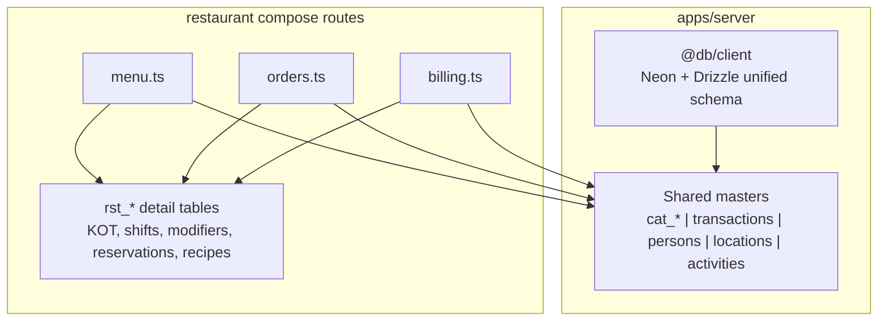

# Restaurant DB Refactor Plan (Revised)

## Goal

Bring the restaurant compose in line with how **CRM, LMS, and hospitality** use the database: Elysia plugin mounted by [`apps/server/src/index.ts`](apps/server/src/index.ts), **`@db/client`** for all persistence, **shared master tables** from [`apps/server/src/infra/db/schema/`](apps/server/src/infra/db/schema/) for cross-compose nouns, and **`rst_*` detail tables only** for restaurant-specific workflow columns.

Remove redundant parallel tables restaurant invented where shared masters already exist. **Schema migration is in scope** (no production data exists).

## Verified facts (not assumptions)

### Compose mounting

Restaurant is an **Elysia plugin library**, same as other composes—not a standalone host:

```19:36:composes/restaurant/server/src/index.ts
export function createRestaurantCompose(mediator: Mediator, bus: EventBus, scheduler?: Scheduler) {
  registerRestaurantHooks(bus, mediator)
  if (scheduler) registerRestaurantJobs(scheduler, mediator, bus)

  return new Elysia({ prefix: '/restaurants' })
    .use(createMenuRoutes(mediator, bus))
    // ...
}
```

Shell mounts it via dynamic import + `.use()` alongside CRM, LMS, ecommerce, hospitality ([`apps/server/src/index.ts`](apps/server/src/index.ts) ~lines 511–558).

### Reference DB import pattern (follow this)

| Compose | DB client | Master tables | Detail tables |
|---------|-----------|---------------|---------------|
| CRM | `@db/client` | `@db/schema/party`, `@db/schema/activity`, … | `../db/schema/crm` |
| Hospitality | `@db/client` | `@db/schema/party`, `@db/schema/location` | `../db/schema/hospitality` |
| LMS | `@db/client` | `@db/schema/catalog`, `@db/schema/commerce`, `@db/schema/party` | `../db/schema/lms` |
| **Restaurant (today)** | **`../lib/db.js` (outlier)** | mediator only for some masters | all `rst_*` direct |

Target for restaurant = **CRM/LMS pattern**:

```typescript
import { db } from '@db/client'
import { catCategories, catItems, catVariants } from '@db/schema/catalog'
import { transactions } from '@db/schema/commerce'
import { persons } from '@db/schema/party'
import { activities } from '@db/schema/activity'
import { locations } from '@db/schema/location'
import { rstKot, rstModifiers, … } from '../db/schema/restaurant'
```

### Master + detail model (from CRM schema comments + hospitality/LMS code)

```
Shared master (apps/server/src/infra/db/schema/)
  persons | parties | cat_items | cat_categories | transactions | locations | activities | pipelines
       ↑ plain text id, no references()
Compose detail (composes/restaurant/server/src/db/schema/)
  rst_* — FSM state, POS/kitchen workflow, join tables only this compose understands
```

---

## Problem diagnosis

Restaurant **partially** uses shared masters via mediator (outlets, menu items, orders, ingredients) but also **maintains duplicate tables** and **bypasses direct master access** that LMS/hospitality use:

| Entity | Correct shared master | Restaurant today | Problem |
|--------|----------------------|------------------|---------|
| Outlets / tables | `locations` | mediator `location.*` | OK (could add direct reads like hospitality) |
| Menu items | `cat_items` (`menu_item`) | mediator `catalog.*` | OK for writes; variants/allergens duplicated in `rst_*` |
| Menu categories | `cat_categories` | **`rst_categories` table** | Duplicates catalog master |
| Item variants | `cat_variants` | **`rst_item_variants`** | Duplicates catalog |
| Allergens | `cat_items.meta` / `attributes` | **`rst_item_allergens`** | Duplicates item fields |
| Orders | `transactions` (`order`) | mediator `commerce.*` | OK |
| Order status audit | `activities` (`type=log`) | **`rst_order_history`** | Duplicates activity master |
| POS bills | `transactions` (`bill`) | **`rst_bills`** | Duplicates commerce master |
| Equipment | `cat_items` (`asset`) | **`rst_equipment`** | Duplicates catalog |
| Staff identity | `persons` | `rst_staff.personId` read-only | Missing person create on staff POST (workplace pattern) |
| Delivery partners | `parties` / compose hub | **`rst_partners`** | Should follow `hsp_partners` (optional `partyId`) |
| Reservations | `persons` + compose hub | **`rst_reservations`** with inline guest fields | Should link `persons` like hospitality |
| Stock movements | `inv_movements` | **`rst_stock_movements`** | Different shape (itemId vs variantId)—**defer or bridge** |

---

## Table disposition

### A. Migrate to shared masters (drop `rst_*` table)

| Drop | Use instead | Field mapping |
|------|-------------|---------------|
| `rst_categories` | `cat_categories` | `mealPeriod`, `outletId`, `imageUrl` → `meta`; filter by `meta.outletId` |
| `rst_item_variants` | `cat_variants` | name, priceAdjustment, isDefault, sortOrder → `attributes` jsonb; auto-generate `sku` |
| `rst_item_allergens` | `cat_items.meta.allergens` | `[{ allergen, severity }]` array in meta |
| `rst_order_history` | `activities` | `type='log'`, `entityType='rst.order'`, `entityId=orderId`, `meta={ fromStatus, toStatus }` |
| `rst_bills` | `transactions` (`type='bill'`) | POS totals in `total`/`tax` money columns; `serviceCharge`, `tip`, `discountTotal`, `billNumber`, `shiftId`, `tableId`, `orderId` → `meta` |
| `rst_equipment` | `cat_items` (`type='asset'`) | serial, warranty, purchaseCost, category → `meta` / `attributes` |

**Keep as compose detail but re-key:**

| Table | Change |
|-------|--------|
| `rst_bill_payments` | Rename `billId` → `transactionId` (→ `transactions` bill row) |
| `rst_bill_splits` | Rename `billId` → `transactionId` |
| `rst_equipment_logs` | Rename `equipmentId` → `itemId` (→ `cat_items` asset) |

### B. Keep as compose detail (`rst_*`) — genuine restaurant workflow

| Table | Why it stays |
|-------|--------------|
| `rst_menu_periods` | Outlet time-window menu availability |
| `rst_modifiers`, `rst_modifier_groups` | POS modifier groups (not in catalog model) |
| `rst_kot`, `rst_kot_items` | Kitchen ticket workflow linked to `transactions` |
| `rst_shifts`, `rst_shift_assignments` | POS cash-drawer shifts + clock in/out |
| `rst_staff` | Operational detail on `persons` (outlet, roles, hourly rate)—dual-master like workplace |
| `rst_reservations`, `rst_waitlist` | Table reservation FSM (compose hub like `hsp_reservations`) |
| `rst_recipes`, `rst_recipe_ingredients` | BOM / prep |
| `rst_stock_movements` | **Phase 2b (optional):** keep until `inv_movements` bridged via default variant per stock item |
| `rst_partners`, `rst_aggregator_mappings` | Delivery/OTA integrations (align structure with `hsp_partners`) |
| `rst_discounts` | POS discount rules |

### C. Continue via mediator (no schema change)

- Order lifecycle commands: `commerce.createTransaction`, `commerce.addLine`, `commerce.updateTransaction`
- Outlet/table CRUD: `location.create`, `location.list`
- Menu item create/update can stay on `catalog.*` **or** move to direct `cat_items` inserts like LMS (Phase 3 preference: direct for reads/writes on masters)

---

## Implementation phases

### Phase 1 — DB client parity (mechanical, low risk)

Same as other composes:

1. Replace `import { db } from '../lib/db.js'` → `import { db } from '@db/client'` in 12 route/hook files
2. Delete [`composes/restaurant/server/src/lib/db.ts`](composes/restaurant/server/src/lib/db.ts)
3. Remove `@neondatabase/serverless` from [`composes/restaurant/server/package.json`](composes/restaurant/server/package.json)
4. Add `relations()` in `restaurant.ts` for existing `with` queries (`rstKot.items`, `rstBills.payments/splits`, `rstRecipes.ingredients`, `rstShiftAssignments.shift`, `rstEquipmentLogs`)

### Phase 2 — Schema migration (drop redundant tables)

1. **Rewrite routes** to use shared masters (see table map above):
   - [`routes/menu.ts`](composes/restaurant/server/src/routes/menu.ts) — categories → `cat_categories`; variants → `cat_variants`; allergens → item meta (reference [`composes/lms/server/src/routes/courses.ts`](composes/lms/server/src/routes/courses.ts) for direct catalog usage)
   - [`routes/orders.ts`](composes/restaurant/server/src/routes/orders.ts) — history → `activities`
   - [`routes/billing.ts`](composes/restaurant/server/src/routes/billing.ts) — bills → `transactions` type `bill`; payments/splits re-keyed
   - [`routes/equipment.ts`](composes/restaurant/server/src/routes/equipment.ts) — assets → `cat_items`; logs re-keyed
   - [`routes/analytics.ts`](composes/restaurant/server/src/routes/analytics.ts) — query `transactions` + `activities` instead of dropped tables

2. **Rewrite [`restaurant.ts`](composes/restaurant/server/src/db/schema/restaurant.ts)**:
   - CRM-style header documenting master/detail split
   - Import `baseColumns` from `@db/schema/helpers` on **kept** `rst_*` tables
   - Remove dropped table definitions
   - Remove `.references()` on kept tables (implicit FK convention per CRM)
   - Add `relations()` exports

3. **Update shell re-exports** in [`apps/server/src/infra/db/schema/index.ts`](apps/server/src/infra/db/schema/index.ts) and [`composes/restaurant/server/src/index.ts`](composes/restaurant/server/src/index.ts) exports

4. **Generate migration** from `apps/server`:
   ```bash
   cd apps/server && bun run db:generate
   ```
   Drops: `rst_categories`, `rst_item_variants`, `rst_item_allergens`, `rst_order_history`, `rst_bills`, `rst_equipment` (+ column renames on payment/split/log tables)

### Phase 3 — Route alignment with compose conventions

Follow patterns from reference composes:

| Area | Reference | Change |
|------|-----------|--------|
| Staff | [`workplace/.../employees.ts`](composes/workplace/server/src/routes/people/employees.ts) | On POST: `person.createPerson` if no `personId`; slim `rst_staff` to operational columns |
| Reservations | [`hospitality/.../reservations.ts`](composes/hospitality/server/src/routes/reservations.ts) | Create/link `persons` (`type='guest'`) instead of inline `guestName` only; keep `rst_reservations` hub |
| Partners | `hsp_partners` schema | Add optional `partyId`; use `baseColumns` |
| Menu items | LMS courses route | Optional: direct `db.insert(catItems)` + meta for restaurant fields instead of only mediator |
| Outlets | Hospitality properties | Optional: direct `@db/schema/location` reads where mediator is thin wrapper |

### Phase 4 — Verify

- `bun run typecheck` in `composes/restaurant/server`
- `bun run db:generate` produces no unexpected diff after migration applied
- Confirm API response shapes unchanged (same JSON fields; internal table ids may differ for migrated entities—acceptable with no data)

---

## Architecture after refactor



---

## Risks / checks

| Risk | Mitigation |
|------|------------|
| `cat_variants` SKU requirement vs menu sizes | Generate synthetic SKU (`{itemId}-{slug(name)}`) in route layer |
| Bill settlement events reference `rst.bill` entity type | Keep event entity types stable; map to `transaction` id internally |
| `person_type` enum lacks `employee` | Use `vendor_contact` or extend enum in shared migration if workplace already relies on `employee` string |
| `inv_movements` deferred | Keep `rst_stock_movements` in Phase 2; revisit in follow-up |
| Relational `with` queries | Add `relations()` in Phase 1 before client swap |
| Hospitality-style `deletedAt` filters | Add `isNull(deletedAt)` on master queries once using `baseColumns` masters |

---

## Files touched (summary)

| Phase | Files |
|-------|-------|
| 1 | 12 route/hook files, delete `lib/db.ts`, `package.json`, `restaurant.ts` (relations) |
| 2 | `restaurant.ts`, `menu.ts`, `orders.ts`, `billing.ts`, `equipment.ts`, `analytics.ts`, `schema/index.ts`, `index.ts`, new migration under `apps/server/src/infra/db/migrations/` |
| 3 | `staff.ts`, `reservations.ts`, `partners.ts`, optional `menu.ts`/`outlets.ts` |
| 4 | `drizzle.config.ts` optional cleanup |

---

## Out of scope

- New features or API surface changes
- Migrating `rst_stock_movements` → `inv_movements` (needs variant bridge design)
- Web compose changes
- Writing tests (per project rules unless asked)
